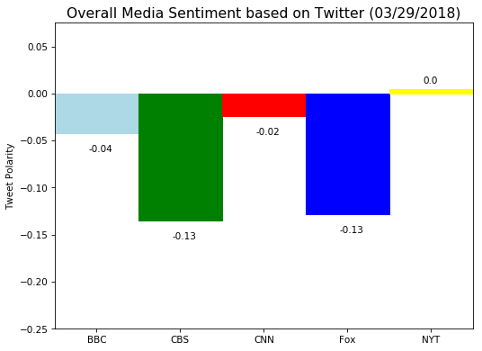

```python
# Dependencies
import pandas as pd
import matplotlib.pyplot as plt
import json
import tweepy
from vaderSentiment.vaderSentiment import SentimentIntensityAnalyzer
analyzer = SentimentIntensityAnalyzer()

# Keys (keys are disabled after assignment submission)
consumer_key = "hMdxJYLNVjzhxDaBFd4rdPPGh"
consumer_secret = "mSa1gDJWtgeG3m07yKS8kO3v5USJmyL3oNXuNVk6Efw4ijCC2s"
access_token = "975592990000349184-7TBMKR3DlxC8ALBrA1PvutwykUP21cO"
access_token_secret = "0sAbPOMYybf2hi8W9xAdmSZNC0jFictireBiOw89ErsfP"

# Setup Tweepy API Authentication
auth = tweepy.OAuthHandler(consumer_key, consumer_secret)
auth.set_access_token(access_token, access_token_secret)
api = tweepy.API(auth, parser=tweepy.parsers.JSONParser())

# News accounts list
news_accounts = ["@BBCWorld", "@CBSNews", "@CNN", "@FoxNews", "@nytimes"]

# Create empty lists for sentiment scores and needed information
# Sentiment lists
compound_list = []
positive_list = []
negative_list = []
neutral_list = []

# Needed information
news_station = []
date_created = []
tweets_ago = []

# Create empty dataframe for results
sentiments_df = pd.DataFrame()


# Loops through news accounts timelines and grab last 100 tweets each
for user in news_accounts:
    
# Set counter to track tweets
    counter = 0

    for x in range(5):
        public_tweets = api.user_timeline(user, page=x)
        
        for tweet in public_tweets:

            text = tweet["text"]
            compound = analyzer.polarity_scores(text)["compound"]
            pos = analyzer.polarity_scores(text)["pos"]
            neu = analyzer.polarity_scores(text)["neu"]
            neg = analyzer.polarity_scores(text)["neg"]

            date_created.append(tweet["created_at"])
            compound_list.append(compound)
            positive_list.append(pos)
            negative_list.append(neg)
            neutral_list.append(neu)
            news_station.append(user)
            tweets_ago.append(counter)
            
            counter = counter + 1

       
            
# Print completion message            
print("Data retrieval is done.")
print("")

# Add data onto dataframe
sentiments_df["News Account"] = news_station
sentiments_df["Date and Time Created (UTC)"] = date_created
sentiments_df["Compound Score"] = compound_list
sentiments_df["Positive Score"] = positive_list
sentiments_df["Negative Score"] = negative_list
sentiments_df["Neutral Score"] = neutral_list
sentiments_df["Tweet Counter"] = tweets_ago

# Check data count
sentiments_df.count()
```

    Data retrieval is done.
    


    News Account                   500
    Date and Time Created (UTC)    500
    Compound Score                 500
    Positive Score                 500
    Negative Score                 500
    Neutral Score                  500
    Tweet Counter                  500
    dtype: int64


```python
# View dataframe
sentiments_df.head()
```


<div>
<style>
    .dataframe thead tr:only-child th {
        text-align: right;
    }

    .dataframe thead th {
        text-align: left;
    }

    .dataframe tbody tr th {
        vertical-align: top;
    }
</style>
<table border="1" class="dataframe">
  <thead>
    <tr style="text-align: right;">
      <th></th>
      <th>News Account</th>
      <th>Date and Time Created (UTC)</th>
      <th>Compound Score</th>
      <th>Positive Score</th>
      <th>Negative Score</th>
      <th>Neutral Score</th>
      <th>Tweet Counter</th>
    </tr>
  </thead>
  <tbody>
    <tr>
      <th>0</th>
      <td>@BBCWorld</td>
      <td>Thu Mar 29 07:51:49 +0000 2018</td>
      <td>0.0000</td>
      <td>0.000</td>
      <td>0.000</td>
      <td>1.000</td>
      <td>0</td>
    </tr>
    <tr>
      <th>1</th>
      <td>@BBCWorld</td>
      <td>Thu Mar 29 06:20:07 +0000 2018</td>
      <td>0.1680</td>
      <td>0.060</td>
      <td>0.000</td>
      <td>0.940</td>
      <td>1</td>
    </tr>
    <tr>
      <th>2</th>
      <td>@BBCWorld</td>
      <td>Thu Mar 29 03:07:47 +0000 2018</td>
      <td>0.6662</td>
      <td>0.223</td>
      <td>0.000</td>
      <td>0.777</td>
      <td>2</td>
    </tr>
    <tr>
      <th>3</th>
      <td>@BBCWorld</td>
      <td>Thu Mar 29 02:20:41 +0000 2018</td>
      <td>-0.4939</td>
      <td>0.000</td>
      <td>0.412</td>
      <td>0.588</td>
      <td>3</td>
    </tr>
    <tr>
      <th>4</th>
      <td>@BBCWorld</td>
      <td>Thu Mar 29 02:13:36 +0000 2018</td>
      <td>-0.8720</td>
      <td>0.000</td>
      <td>0.553</td>
      <td>0.447</td>
      <td>4</td>
    </tr>
  </tbody>
</table>
</div>


```python
# Save into csv file
sentiments_df.to_csv("News_Sentiments.csv")
```


```python
# Additional dependency
import time

# Obtain compound score and tweet counter for tweets
bbc_df = sentiments_df.loc[sentiments_df["News Account"] == "@BBCWorld"]
bbc_comp = bbc_df["Compound Score"]
bbc_tweets_ago = bbc_df["Tweet Counter"]

cbs_df = sentiments_df.loc[sentiments_df["News Account"] == "@CBSNews"]
cbs_comp = cbs_df["Compound Score"]
cbs_tweets_ago = cbs_df["Tweet Counter"]

cnn_df = sentiments_df.loc[sentiments_df["News Account"] == "@CNN"]
cnn_comp = cnn_df["Compound Score"]
cnn_tweets_ago = cnn_df["Tweet Counter"]

fox_df = sentiments_df.loc[sentiments_df["News Account"] == "@FoxNews"]
fox_comp = fox_df["Compound Score"]
fox_tweets_ago = fox_df["Tweet Counter"]

nyt_df = sentiments_df.loc[sentiments_df["News Account"] == "@nytimes"]
nyt_comp = nyt_df["Compound Score"]
nyt_tweets_ago = nyt_df["Tweet Counter"]

# Plot scatter plot
plt.figure(figsize=(8,6), dpi=75)
bbc = plt.scatter(bbc_tweets_ago, bbc_comp, s=100, facecolors="lightblue", linewidth=2, edgecolors="black", 
                       label="BBC")
cbs = plt.scatter(cbs_tweets_ago, cbs_comp, s=100, facecolors="green", linewidth=2, edgecolors="black", 
                       label="CBS")
cnn = plt.scatter(cnn_tweets_ago, cnn_comp, s=100, facecolors="red", linewidth=2, edgecolors="black", 
                       label="CNN")
fox = plt.scatter(fox_tweets_ago, fox_comp, s=100, facecolors="blue", linewidth=2, edgecolors="black", 
                       label="Fox")
nyt = plt.scatter(nyt_tweets_ago, nyt_comp, s=100, facecolors="yellow", linewidth=2, edgecolors="black", 
                       label="New York Times")
# Chart aesthetics
plt.title("Sentiment Analysis of Media Tweets (%s)" % (time.strftime("%m/%d/%Y")), fontsize=15)
plt.xlabel("Tweets Ago")
plt.ylabel("Tweet Polarity")

plt.xlim(105,-5)
plt.ylim(-1.05, 1.05)

plt.grid()

# Add legend
plt.legend(handles=[bbc, cbs, cnn, fox, nyt], title="Media Sources", loc="upper right", bbox_to_anchor=(1.3,1))

# Save and show chart
plt.savefig("sentiment_scatter.png")
plt.show()
```


```python
# Obtain compound score mean
bbc_mean = bbc_comp.mean()
cbs_mean = cbs_comp.mean()
cnn_mean = cnn_comp.mean()
fox_mean = fox_comp.mean()
nyt_mean = nyt_comp.mean()

# Create lists for bar chart
mean_values = [bbc_mean, cbs_mean, cnn_mean, fox_mean, nyt_mean]
news_names = ["BBC", "CBS", "CNN", "Fox", "NYT"]

# Plot bar chart
plt.figure(figsize=(8,6), dpi=75)
barlist = plt.bar(news_names, mean_values, edgecolor="black", linewidth=1.0, width=1.0)

# Chart aesthetics
barlist[0].set_color("lightblue")
barlist[1].set_color("green")
barlist[2].set_color("red")
barlist[3].set_color("blue")
barlist[4].set_color("yellow")

plt.title("Overall Media Sentiment based on Twitter (%s)" % (time.strftime("%m/%d/%Y")), fontsize=15)
plt.ylabel("Tweet Polarity")

plt.xlim(-0.5, 4.5)
plt.ylim(-0.25, 0.075)

# Add in values for each bar
for a,b in enumerate(mean_values):    
    if b > 0:
        plt.text(a-0.1, b+b+0.001, str(round(b,2)))
    else:
        plt.text(a-0.1, b-0.02, str(round(b,2)))

# Save and show chart
plt.savefig("overall_sentiment_bar.png")
plt.show()
```





Three observable trends:
1) Almost all of the news media Twitter accounts (except for New York Times) are exhibiting negative scores from their recent Twitter statuses.
2) New York Times has been generally neutral based on the bar chart and distribution on the scatter plot.
3) CBS and Fox are both the most and equally negative based on the average compound score on the bar chart.
